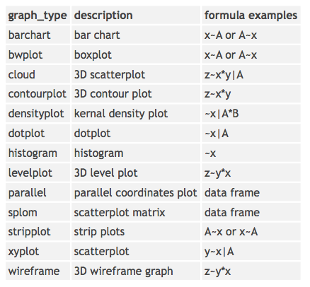

#### [GNU Scientific Library](http://www.gnu.org/software/gsl/)
- A free numerical library for C and C++ programmers


---

#### [Python](http://www.python.org) 

- A beginner [tutorial](https://wakari.io/gallery) 
- Notebook viewer [link](http://nbviewer.ipython.org)
- Python [data type](http://www.tutorialspoint.com/python/python_variable_types.htm)  
- Pandas [data type](http://pandas.pydata.org/pandas-docs/stable/dsintro.html)
- [Statsmodels module](http://statsmodels.sourceforge.net)

  ...[more](foo) 

---

#### [R](http://www.r-project.org)

- [RStudio](https://www.rstudio.com) (A very good IDE for R)

  To generate graphs with a better resolution, add the following parameters 
  
  >  ```{r fig1, fig.width=9, fig.height=3, unit="in", dpi=200}
  >  ```

- Style [guide](assets/google_style.pdf) recommended by google

- Lattice (trellis) [graphs](http://www.statmethods.net/advgraphs/trellis.html) 
   

---

#### Stata
- Stata [graphs](http://www.stata.com/support/faqs/graphics/gph/stata-graphs/)

---

#### LaTeX
- Math [notations](http://en.wikibooks.org/wiki/LaTeX/Mathematics)
- Math [symbols](http://web.ift.uib.no/Teori/KURS/WRK/TeX/symALL.html)
- Hightlighting and underlining 

  > \usepackage{soul, color}
---

#### Vim 
- LaTex [shortcuts](http://vim-latex.sourceforge.net/documentation/latex-suite/latex-macros.html)
- Most productive [shortcuts](http://stackoverflow.com/questions/1218390/what-is-your-most-productive-shortcut-with-vim/1218429)
- close a buffer:  `:BW` 
- (insert) VISUAL model:  `ctrl+o, v`.

---

#### GitHub
- Create project page [(gh-pages)](https://help.github.com/articles/creating-project-pages-manually)

--- 
*Last updated Apirl 2014*